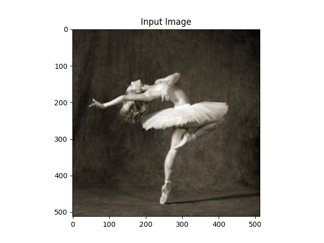

# Artistic-Style-Transfer
The project is an implementation of the [Neural Style Transfer Algorithm](https://arxiv.org/abs/1508.06576) developed by Leon A. Gatys, Alexander S. Ecker and Matthias Bethge.

## Working
The style transfer works by defining two types of losses viz. style loss (for the style portion of the image) and content loss(for content portion of image). The two losses measure the distance of the respective parameters from their source images and the objective of the algorithm is to minimize both so that the final output image can have the content form the content image and the style from the style image.

## Steps
1. Loads the VGG-19 model pre-trained on a large dataset of ImageNet(I can't upload the pre-trained model as it's very big in size, but one can easily find it by a simlple Google search;)
2. Computes the Content cost
3. Computes the Gram matrix which is later used to find the Style cost
4. Computes the Style cost from several layers
5. Initialises the generated image as a Content Image
6. Outputs the generated image in folder-output

## Outputs
Style and Content Image|
:-----------:|
|

Input Image| Output Image|
:---:|:----:|
||
